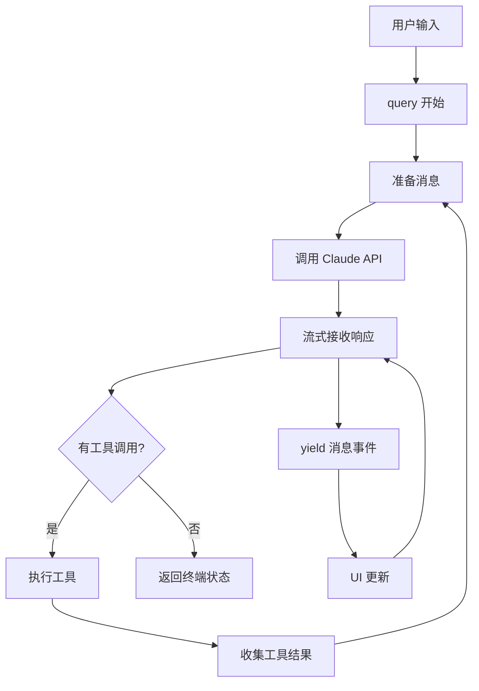

# 第1章：初识 Claude Code —— 一个 AI 编程助手的设计哲学

> "编程的本质不是编写代码，而是解决问题。当我们能够用自然语言描述问题，代码就只是一种可选的表达形式。"

---

## 目录

1.1 [AI 编程助手的本质：对话即编程](#11-ai-编程助手的本质对话即编程)
1.2 [Claude Code 的设计目标：安全、高效、可扩展](#12-claude-code-的设计目标安全高效可扩展)
1.3 [源码全景：1902 个源码文件的地图](#13-源码全景1902-个源码文件的地图)
1.4 [从入口到交互：一次完整对话的生命周期](#14-从入口到交互一次完整对话的生命周期)
1.5 [核心抽象三剑客：Query、Tool、Command](#15-核心抽象三剑客querytoolcommand)
1.6 [小结与思考](#16-小结与思考)

---

## 1.1 AI 编程助手的本质：对话即编程

Claude Code 代表了一种全新的编程范式——**对话式编程**（Conversational Programming）。在这个范式中，自然语言对话不再仅仅是辅助工具，而是成为了编程的主要界面。

### 1.1.1 从入口看系统设计

让我们从程序的入口开始探索。实际的入口点是 `src/entrypoints/cli.tsx`，它首先执行一系列快速路径检查：

```typescript
// src/entrypoints/cli.tsx:33-42
async function main(): Promise<void> {
  const args = process.argv.slice(2);

  // Fast-path for --version/-v: zero module loading needed
  if (args.length === 1 && (args[0] === '--version' || args[0] === '-v' || args[0] === '-V')) {
    console.log(`${MACRO.VERSION} (Claude Code)`);
    return;
  }
  // ...
}
```

这种快速路径设计体现了性能优先的思想：常见操作（如查看版本）应该零延迟。核心初始化逻辑在 `src/setup.ts` 中展开：

```typescript
// src/setup.ts:56-100 (简化)
export async function setup(
  cwd: string,
  permissionMode: PermissionMode,
  allowDangerouslySkipPermissions: boolean,
  worktreeEnabled: boolean,
  worktreeName: string | undefined,
  tmuxEnabled: boolean,
  customSessionId?: string | null,
  ...
): Promise<void> {
  // 1. 检查 Node.js 版本
  const nodeVersion = process.version.match(/^v(\d+)\./)?.[1]
  if (!nodeVersion || parseInt(nodeVersion) < 18) {
    console.error(chalk.bold.red(
      'Error: Claude Code requires Node.js version 18 or higher.',
    ))
    process.exit(1)
  }

  // 2. 启动 UDS 消息服务器（用于 Agent 间通信）
  if (feature('UDS_INBOX')) {
    await startUdsMessaging(messagingSocketPath)
  }

  // 3. 捕获 hooks 配置快照
  captureHooksConfigSnapshot()

  // 4. 初始化文件变化监听器
  initializeFileChangedWatcher(cwd)

  // 5. 处理 worktree 创建（如果启用）
  if (worktreeEnabled) {
    const worktreeSession = await createWorktreeForSession(...)
  }

  // 6. 初始化后台任务
  initSessionMemory()
}
```

这个入口设计展现了几个核心设计思想：

1. **特性门控（Feature Flags）**：使用 `feature()` 函数控制实验性功能的启用
2. **配置快照**：在启动时捕获配置，避免运行时被隐式修改
3. **渐进式初始化**：每个初始化步骤都是独立的，失败不会阻止其他功能

### 1.1.2 query 函数：对话循环的心脏

`src/query.ts` 中的 `query` 函数是整个对话循环的核心。这是一个约 1700 行的函数，却展现了一个极其清晰的循环结构：

```typescript
// src/query.ts:219-239
export async function* query(
  params: QueryParams,
): AsyncGenerator<
  | StreamEvent
  | RequestStartEvent
  | Message
  | TombstoneMessage
  | ToolUseSummaryMessage,
  Terminal
> {
  const consumedCommandUuids: string[] = []
  const terminal = yield* queryLoop(params, consumedCommandUuids)

  // 命令生命周期通知
  for (const uuid of consumedCommandUuids) {
    notifyCommandLifecycle(uuid, 'completed')
  }
  return terminal
}
```

**设计亮点**：

1. **AsyncGenerator 返回类型**：使用异步生成器，使得函数可以逐步产生消息，而不是一次性返回所有结果
2. **Terminal 返回值**：函数最终返回一个 `Terminal` 对象，表示对话的终止状态
3. **命令生命周期追踪**：通过 `consumedCommandUuids` 数组追踪所有已执行的命令

### 1.1.3 消息的统一抽象

Claude Code 中的所有交互都通过 `Message` 类型表示。`Tool.ts` 导入了 `'./types/message.js'`，但该路径实际对应编译产物或间接解析（源码中不存在独立的 `src/types/message.ts` 文件），消息类型定义分散在多个模块中：

```typescript
// src/Tool.ts:32-40
import type {
  AssistantMessage,
  AttachmentMessage,
  Message,
  ProgressMessage,
  SystemMessage,
  UserMessage,
} from './types/message.js'
```

这种统一的消息抽象带来几个好处：

- **类型安全**：每种消息类型都有明确的结构
- **可扩展性**：添加新的消息类型只需扩展联合类型
- **序列化友好**：所有消息都可以轻松序列化存储或传输

### 1.1.4 设计思想总结

> **设计思想 1：消息驱动架构**
>
> 将所有交互统一为消息流，通过异步生成器实现流式处理，赋予系统天然的响应性和可组合性。

---

## 1.2 Claude Code 的设计目标：安全、高效、可扩展

Claude Code 的架构围绕三个核心目标展开：**安全**（Safety）、**高效**（Efficiency）、**可扩展**（Extensibility）。

### 1.2.1 安全：多层防护体系

#### 权限系统（Permission System）

权限系统是 Claude Code 安全设计的核心。`src/Tool.ts` 定义了工具的权限上下文：

```typescript
// src/Tool.ts:123-138
export type ToolPermissionContext = DeepImmutable<{
  mode: PermissionMode
  additionalWorkingDirectories: Map<string, AdditionalWorkingDirectory>
  alwaysAllowRules: ToolPermissionRulesBySource
  alwaysDenyRules: ToolPermissionRulesBySource
  alwaysAskRules: ToolPermissionRulesBySource
  isBypassPermissionsModeAvailable: boolean
  isAutoModeAvailable?: boolean
  strippedDangerousRules?: ToolPermissionRulesBySource
  /** When true, permission prompts are auto-denied */
  shouldAvoidPermissionPrompts?: boolean
  /** Stores the permission mode before model-initiated plan mode entry */
  prePlanMode?: PermissionMode
}>
```

每个工具都必须参与权限检查流程：

```typescript
// 权限检查流程（示意）
1. validateInput() - 验证输入格式
2. checkPermissions() - 检查权限
3. canUseTool() - 最终确认
4. 执行工具
```

#### 沙箱机制（Sandboxing）

对于 Bash 等危险工具，Claude Code 实现了沙箱机制。从 `BashTool.tsx` 可以看到安全检查的实现：

```typescript
// src/tools/BashTool/BashTool.tsx:17
import { parseForSecurity } from '../../utils/bash/ast.js'
```

这表明系统对命令进行抽象语法树解析，以检测潜在的安全威胁。

### 1.2.2 高效：流式处理与上下文压缩

#### 流式工具执行（Streaming Tool Execution）

`src/services/tools/StreamingToolExecutor.ts` 实现了一个复杂的并发控制系统。虽然我们无法直接读取该文件，但从 `query.ts` 的导入可以看出其核心作用：

```typescript
// src/query.ts:96
import { StreamingToolExecutor } from './services/tools/StreamingToolExecutor.js'
```

这个设计允许：
- **并发安全**的工具（如多个 Read）可以同时执行
- **非并发安全**的工具（如 Write）需要独占访问
- 结果按工具调用的顺序返回，而不是按完成顺序

#### 上下文压缩（Context Compaction）

当对话历史过长时，系统会自动压缩上下文。从 `query.ts` 可以看到相关导入：

```typescript
// src/query.ts:12-14
import {
  calculateTokenWarningState,
  isAutoCompactEnabled,
  type AutoCompactTrackingState,
} from './services/compact/autoCompact.js'
```

压缩策略包括：
1. **历史摘要**：使用 AI 摘要旧消息
2. **缓存编辑**：删除不再相关的缓存内容
3. **Snip**：移除中间的"噪音"消息

### 1.2.3 可扩展：工具注册与 MCP 协议

#### 工具注册系统

所有工具都实现统一的 `Tool` 接口。从 `src/tools.ts` 可以看到工具的注册方式：

```typescript
// src/tools.ts:1-13
import { toolMatchesName, type Tool, type Tools } from './Tool.js'
import { AgentTool } from './tools/AgentTool/AgentTool.js'
import { SkillTool } from './tools/SkillTool/SkillTool.js'
import { BashTool } from './tools/BashTool/BashTool.js'
import { FileEditTool } from './tools/FileEditTool/FileEditTool.js'
import { FileReadTool } from './tools/FileReadTool/FileReadTool.js'
import { FileWriteTool } from './tools/FileWriteTool/FileWriteTool.js'
import { GlobTool } from './tools/GlobTool/GlobTool.js'
// ... 更多工具
```

`buildTool` 函数提供了安全的默认值模式，使得创建新工具变得简单。

#### MCP 协议支持

从目录结构可以看到 `src/services/mcp/` 目录，表明系统完整实现了 Model Context Protocol，允许外部服务器提供工具和资源。

### 1.2.4 设计思想总结

> **设计思想 2：安全-高效-可扩展三角平衡**
>
> - 安全：通过多层次的权限系统和沙箱机制，在提供强大能力的同时保护用户系统
> - 高效：通过流式处理和多层上下文压缩，实现实时响应和长对话支持
> - 可扩展：通过统一的工具接口和 MCP 协议，实现能力的无限扩展

---

## 1.3 源码全景：1902 个源码文件的地图

Claude Code 的 `src/` 目录当前包含约 1902 个源码文件，形成了一个复杂而有序的架构。

### 1.3.1 目录结构全景

```
src/
├── tools/              # 38+ 工具实现
│   ├── BashTool/       # Shell 命令执行
│   ├── FileReadTool/   # 文件读取
│   ├── FileEditTool/   # 文件编辑
│   ├── GrepTool/       # 内容搜索
│   ├── GlobTool/       # 文件搜索
│   ├── AgentTool/      # 子 Agent 管理
│   └── ...
├── components/         # 146+ React 组件（UI 渲染）
│   ├── Messages.tsx    # 消息列表
│   ├── Message.tsx     # 单条消息
│   ├── Spinner.tsx     # 加载动画
│   └── ...
├── ink/                # 50+ 终端 UI 文件
│   ├── components/     # Ink 基础组件
│   └── reconciler.tsx  # React 到终端的渲染器
├── services/           # 38+ 服务模块
│   ├── compact/        # 上下文压缩
│   ├── mcp/            # MCP 协议实现
│   ├── api/            # API 调用封装
│   └── ...
├── hooks/              # 87+ React Hooks
│   ├── useCanUseTool.ts
│   ├── useAppState.ts
│   └── ...
├── commands/           # 103+ 命令实现
│   ├── commit/
│   ├── review/
│   ├── plan/
│   └── ...
├── types/              # 类型定义（7个.ts文件 + generated/）
│   ├── command.ts      # 命令类型
│   ├── hooks.ts        # Hooks 类型
│   ├── ids.ts          # ID 生成类型
│   ├── logs.ts         # 日志类型
│   ├── permissions.ts  # 权限类型
│   ├── plugin.ts       # 插件类型
│   ├── textInputTypes.ts # 文本输入类型
│   └── generated/      # 自动生成的类型
├── utils/              # 工具函数
├── state/              # 状态管理
├── tasks/              # 后台任务
│   ├── LocalAgentTask/
│   ├── InProcessTeammateTask/
│   ├── LocalShellTask/
│   └── ...
├── assistant/          # Assistant 模式
├── bridge/             # 桥接功能
├── coordinator/        # 协调器
├── plugins/            # 插件系统
├── skills/             # 技能系统
├── entrypoints/        # 入口点
│   └── cli.tsx         # CLI 入口
├── query.ts            # 对话循环核心
├── Tool.ts             # 工具接口定义
├── commands.ts         # 命令注册表
└── main.tsx            # 主入口文件
```

### 1.3.2 关键模块详解

#### tools/：工具实现的动物园

每个工具都是一个独立的目录，包含：
- `prompt.ts`：工具的系统提示词
- `*.ts`：工具实现逻辑
- `types.ts`：类型定义

以 `BashTool` 为例：

```
src/tools/BashTool/
├── prompt.ts           # 工具描述和提示词
├── bashPermissions.ts  # 权限检查逻辑
├── bashSecurity.ts     # 安全检查（命令注入等）
├── commandSemantics.ts # 命令语义分析
├── destructiveCommandWarning.ts # 破坏性命令警告
├── modeValidation.ts   # 模式验证
├── pathValidation.ts   # 路径验证
├── sedValidation.ts    # sed 命令验证
├── shouldUseSandbox.ts # 沙箱决策
├── toolName.ts         # 工具名称常量
└── BashTool.tsx        # 主实现
```

#### components/：React 组件的花园

尽管是终端应用，Claude Code 使用 React 构建界面：

- `Messages.tsx`：管理所有消息的渲染
- `Message.tsx`：渲染单条消息（用户/AI/系统）
- `StructuredDiff.tsx`：代码差异显示
- `TaskListV2.tsx`：任务列表组件
- `ModelPicker.tsx`：模型选择器

#### services/：后台服务的机房

- `compact/`：上下文压缩服务（自动、反应式、snip）
- `mcp/`：MCP 服务器连接和管理
- `api/`：Claude API 调用封装（重试、流式）
- `analytics/`：遥测和分析
- `skillSearch/`：技能搜索和发现

#### tasks/：任务系统的引擎

- `LocalAgentTask`：本地 AI Agent 任务
- `InProcessTeammateTask`：进程内队友任务
- `LocalShellTask`：本地 Shell 任务
- `RemoteAgentTask`：远程 Agent 任务
- `DreamTask`：Dream 模式任务

### 1.3.3 代码组织的思想

Claude Code 的代码组织体现了几个重要原则：

1. **按功能分层**：工具、组件、服务、钩子各司其职
2. **按职责分模块**：每个目录都有明确的职责边界
3. **可组合性**：小模块通过组合实现复杂功能

> **设计思想 3：模块化与可组合性**
>
> 将系统分解为独立、可测试的模块，通过清晰的接口进行组合。这种设计使得新功能的添加不会影响现有代码，也便于团队协作开发。

---

## 1.4 从入口到交互：一次完整对话的生命周期

让我们追踪一次完整的对话，从用户输入到 AI 响应。

### 1.4.1 启动阶段：cli.tsx → main.tsx → init.ts → setup.ts

Claude Code 的启动并非简单的两步跳转，而是一条精心设计的四级调用链：

```
cli.tsx（快速路径分派）
  └→ main.tsx（Commander 命令行解析、参数处理）
       └→ init.ts（341行，15+项系统级初始化）
            └→ setup.ts（环境检查、UDS消息、hooks快照、文件监听）
```

**第一级：cli.tsx** —— 极简入口，只做分派：

```typescript
// src/entrypoints/cli.tsx:33-42（简化）
async function main(): Promise<void> {
  const args = process.argv.slice(2);

  // 快速路径检查（零模块加载）
  if (args.length === 1 && (args[0] === '--version' || args[0] === '-v')) {
    console.log(`${MACRO.VERSION} (Claude Code)`);
    return;
  }

  // 其他快速路径：--dump-system-prompt, --daemon-worker,
  // --chrome, remote-control, daemon, templates 等

  // 非快速路径：加载完整 CLI
  const { main: cliMain } = await import('../main.js');
  await cliMain();
}
```

**第二级：main.tsx** —— Commander 解析与业务编排。

**第三级：init.ts** —— 系统级初始化桥梁（341行），承担 15+ 项关键任务：

```typescript
// src/entrypoints/init.ts:57-238（核心任务清单）
export const init = memoize(async (): Promise<void> => {
  // 1. enableConfigs()          — 配置系统启用
  // 2. applySafeConfigEnvironmentVariables() — 安全环境变量
  // 3. applyExtraCACertsFromConfig()  — TLS 证书
  // 4. setupGracefulShutdown()  — 优雅退出注册
  // 5. initialize1PEventLogging() — 一方事件日志
  // 6. populateOAuthAccountInfoIfNeeded() — OAuth 信息
  // 7. initJetBrainsDetection() — JetBrains IDE 检测
  // 8. detectCurrentRepository() — Git 仓库检测
  // 9. initializeRemoteManagedSettingsLoadingPromise() — 远程设置
  // 10. initializePolicyLimitsLoadingPromise() — 策略限制
  // 11. recordFirstStartTime()  — 首次启动记录
  // 12. configureGlobalMTLS()   — mTLS 配置
  // 13. configureGlobalAgents() — 全局 HTTP 代理
  // 14. preconnectAnthropicApi() — API 预连接
  // 15. initUpstreamProxy()     — 上游代理（CCR 模式）
  // 16. setShellIfWindows()     — Windows shell 设置
  // 17. registerCleanup()       — LSP/Team 清理注册
  // 18. ensureScratchpadDir()   — 临时目录初始化
})
```

**第四级：setup.ts** —— 运行环境准备与交互式启动。

这种四级架构的设计思想是：**每一层只做该做的事，绝不多加载一个模块**。

### 1.4.2 REPL 循环：等待输入

虽然我们无法直接看到 REPL 的完整实现，但从 `src/screens/REPL.tsx` 的导入可以看出其复杂性：

```typescript
// src/screens/REPL.tsx:1-80（部分导入）
import { useSearchInput } from '../hooks/useSearchInput.js'
import { useTerminalSize } from '../hooks/useTerminalSize.js'
import { type Command, type CommandResultDisplay } from '../commands.js'
import type { PromptInputMode, QueuedCommand, VimMode } from '../types/textInputTypes.js'
import { MessageSelector } from '../components/MessageSelector.js'
import PromptInput from '../components/PromptInput/PromptInput.js'
```

简化版的 REPL 循环逻辑：

```typescript
// 简化的 REPL 循环
async function replLoop() {
  while (true) {
    // 显示提示符
    renderPrompt()

    // 等待用户输入
    const input = await waitForInput()

    // 处理斜杠命令
    if (input.startsWith('/')) {
      await handleSlashCommand(input)
      continue
    }

    // 发送给 query 函数
    for await (const event of query({
      messages: [...history, createUserMessage(input)],
      systemPrompt,
      tools,
      ...
    })) {
      // 处理流式事件
      handleStreamEvent(event)
    }
  }
}
```

### 1.4.3 query 循环：请求-响应



### 1.4.4 工具执行：权限检查与执行

从 `src/query.ts` 可以看到工具执行的编排：

```typescript
// src/query.ts:98
import { runTools } from './services/tools/toolOrchestration.js'
```

简化的工具执行流程：

```typescript
// 简化的工具执行
async function* runTools(
  toolUseBlocks: ToolUseBlock[],
  assistantMessages: AssistantMessage[],
  canUseTool: CanUseToolFn,
  context: ToolUseContext,
) {
  for (const toolUse of toolUseBlocks) {
    const tool = findToolByName(tools, toolUse.name)

    // 1. 验证输入
    const validationResult = await tool.validateInput?.(toolUse.input, context)
    if (validationResult?.result === false) {
      yield createErrorMessage(validationResult.message)
      continue
    }

    // 2. 检查权限
    const permissionResult = await tool.checkPermissions(toolUse.input, context)
    if (permissionResult.behavior === 'deny') {
      yield createDeniedMessage()
      continue
    }
    if (permissionResult.behavior === 'ask') {
      const userDecision = await askUser(permissionResult.message)
      if (!userDecision.approved) {
        yield createDeniedMessage()
        continue
      }
    }

    // 3. 最终确认
    const canUse = await canUseTool(tool, toolUse.input, context)
    if (!canUse.approved) {
      yield createDeniedMessage(canUse.reason)
      continue
    }

    // 4. 执行工具
    try {
      const result = await tool.call(
        permissionResult.updatedInput || toolUse.input,
        context,
        canUseTool,
        assistantMessage,
        onProgress,
      )
      yield createToolResultMessage(result)
    } catch (error) {
      yield createErrorMessage(error.message)
    }
  }
}
```

**设计思想总结**：
- **多层检查**：validateInput → checkPermissions → canUseTool，层层把关
- **用户可见**：每次拒绝都有明确的错误消息
- **流式友好**：使用 AsyncGenerator 使得工具执行过程可以产生中间状态

---

## 1.5 核心抽象三剑客：Query、Tool、Command

Claude Code 的架构围绕三个核心抽象展开。

### 1.5.1 Query：对话循环

`src/query.ts` 中的 `query` 函数是对话循环的抽象：

```typescript
// src/query.ts:219-239
export async function* query(
  params: QueryParams,
): AsyncGenerator<
  | StreamEvent
  | RequestStartEvent
  | Message
  | TombstoneMessage
  | ToolUseSummaryMessage,
  Terminal
> {
  const consumedCommandUuids: string[] = []
  const terminal = yield* queryLoop(params, consumedCommandUuids)

  for (const uuid of consumedCommandUuids) {
    notifyCommandLifecycle(uuid, 'completed')
  }
  return terminal
}
```

**核心特性**：
- **纯函数式**：相同的输入总是产生相同的输出
- **流式输出**：使用 `AsyncGenerator` 产生事件流
- **状态封装**：所有可变状态都在函数内部

**相关类型**：

```typescript
// src/query.ts:181-199
export type QueryParams = {
  messages: Message[]
  systemPrompt: SystemPrompt
  userContext: { [k: string]: string }
  systemContext: { [k: string]: string }
  canUseTool: CanUseToolFn
  toolUseContext: ToolUseContext
  fallbackModel?: string
  querySource: QuerySource
  maxOutputTokensOverride?: number
  maxTurns?: number
  skipCacheWrite?: boolean
  taskBudget?: { total: number }
  deps?: QueryDeps
}
```

### 1.5.2 Tool：能力单元

`src/Tool.ts` 中的 `Tool` 类型是所有工具的接口：

```typescript
// src/Tool.ts:362-695（核心部分）
export type Tool<Input = AnyObject, Output = unknown> = {
  // 基础信息
  name: string
  aliases?: string[]
  searchHint?: string

  // 核心方法
  call: (
    args: z.infer<Input>,
    context: ToolUseContext,
    canUseTool: CanUseToolFn,
    parentMessage: AssistantMessage,
    onProgress?: ToolCallProgress,
  ) => Promise<ToolResult<Output>>

  // 描述和验证
  description: (input, options) => Promise<string>
  inputSchema: AnyObject
  validateInput?: (input, context) => Promise<ValidationResult>

  // 权限和安全
  checkPermissions: (input, context) => Promise<PermissionResult>
  isReadOnly: (input) => boolean
  isDestructive?: (input) => boolean

  // 并发控制
  isConcurrencySafe: (input) => boolean
  interruptBehavior?: () => 'cancel' | 'block'

  // UI 渲染
  renderToolUseMessage: (input, options) => React.ReactNode
  renderToolResultMessage?: (content, progress, options) => React.ReactNode
  renderToolUseProgressMessage?: (progress, options) => React.ReactNode
  renderToolUseRejectedMessage?: (input, options) => React.ReactNode
  renderToolUseErrorMessage?: (result, options) => React.ReactNode

  // 工具方法
  isEnabled: () => boolean
  getPath?: (input) => string
  userFacingName: (input) => string
  getActivityDescription?: (input) => string | null
  toAutoClassifierInput: (input) => unknown
}
```

**设计亮点**：

1. **可选方法模式**：大多数方法都是可选的，工具只需要实现需要的功能
2. **渐进式增强**：基础工具只需实现 `call` 和 `description`，高级工具可以添加更多方法
3. **类型安全**：使用 Zod schema 确保输入验证

**工具创建辅助函数**：

```typescript
// src/Tool.ts:783-792
export function buildTool<D extends AnyToolDef>(def: D): BuiltTool<D> {
  return {
    ...TOOL_DEFAULTS,
    userFacingName: () => def.name,
    ...def,
  } as BuiltTool<D>
}
```

### 1.5.3 Command：用户命令

`src/commands.ts` 和 `src/types/command.ts` 定义了命令系统：

```typescript
// src/types/command.ts:16-57（部分）
export type PromptCommand = {
  type: 'prompt'
  progressMessage: string
  contentLength: number
  argNames?: string[]
  allowedTools?: string[]
  model?: string
  source: SettingSource | 'builtin' | 'mcp' | 'plugin' | 'bundled'
  getPromptForCommand(
    args: string,
    context: ToolUseContext,
  ): Promise<ContentBlockParam[]>
}

export type LocalCommand = {
  type: 'local'
  supportsNonInteractive: boolean
  load: () => Promise<LocalCommandModule>
}
```

命令有三种主要类型：

**1. PromptCommand（提示词命令）**

示例：`/commit` 命令生成 commit 消息的提示词

**2. LocalCommand（本地命令）**

示例：`/compact` 命令执行上下文压缩

**3. LocalJSXCommand（JSX 渲染命令）**

示例：`/help` 命令渲染帮助界面

**命令与工具的区别**：

| 特性 | Command（命令） | Tool（工具） |
|------|----------------|-------------|
| 触发方式 | 用户输入 `/command` | AI 决策调用 |
| 执行位置 | 客户端 | 可能在服务端 |
| UI 渲染 | 可以渲染 JSX | 不渲染 UI |
| 用途 | 用户控制 AI 行为 | AI 操作外部系统 |

### 1.5.4 三者的协作关系

```
┌─────────────────────────────────────────────────────────────┐
│                         Query                               │
│  （对话循环，管理消息流和工具调用）                          │
│                                                             │
│  ┌─────────────────────────────────────────────────────┐   │
│  │                    Tool Pool                        │   │
│  │  （所有可用工具的集合）                              │   │
│  │                                                     │   │
│  │  ┌──────────┐  ┌──────────┐  ┌──────────┐        │   │
│  │  │ BashTool │  │ ReadTool │  │ EditTool │  ...   │   │
│  │  └──────────┘  └──────────┘  └──────────┘        │   │
│  └─────────────────────────────────────────────────────┘   │
│                                                             │
│  ┌─────────────────────────────────────────────────────┐   │
│  │                    Command List                     │   │
│  │  （用户可调用的命令）                                │   │
│  │                                                     │   │
│  │  ┌─────────┐  ┌─────────┐  ┌─────────┐          │   │
│  │  │ /commit │  │ /clear  │  │ /plan   │  ...     │   │
│  │  └─────────┘  └─────────┘  └─────────┘          │   │
│  └─────────────────────────────────────────────────────┘   │
└─────────────────────────────────────────────────────────────┘
```

在执行流程中：
1. **Command** 可以修改 Query 的状态（如 `/plan` 切换到计划模式）
2. **Query** 调用 **Tool** 完成具体操作
3. **Tool** 的结果返回给 **Query**，形成对话历史

> **设计思想 4：三层抽象的清晰分工**
>
> - Query：控制流程，管理对话状态
> - Tool：执行操作，提供能力
> - Command：用户接口，快捷操作
>
> 三者各司其职，通过清晰的接口协作，构成了一个完整的系统。

---

## 1.6 小结与思考

### 1.6.1 核心设计原则总结

1. **消息驱动架构**：将所有交互统一为消息流，通过异步生成器实现流式处理

2. **安全-高效-可扩展三角平衡**：
   - 安全：多层次的权限系统和沙箱机制
   - 高效：流式处理和多层上下文压缩
   - 可扩展：统一的工具接口和 MCP 协议

3. **模块化与可组合性**：将系统分解为独立、可测试的模块

4. **状态机与流式处理的结合**：查询循环是一个状态机，每次迭代都是一个状态转换

5. **三层抽象的清晰分工**：Query 控制流程，Tool 执行操作，Command 提供用户接口

### 1.6.2 架构亮点

1. **纯函数式核心**：`query` 函数是纯函数，所有状态都是参数传入

2. **React 渲染终端**：通过 Ink，React 组件可以直接渲染到终端

3. **工具并发控制**：`StreamingToolExecutor` 实现了精细的并发控制

4. **上下文管理**：多层次的压缩策略确保对话可以无限继续

5. **依赖注入模式**：通过 `QueryDeps` 类型，可以轻松注入测试替身

### 1.6.3 未来展望

Claude Code 的架构为未来留下了广阔的空间：

- **多模态支持**：Tool 接口已经支持图像处理
- **分布式执行**：通过 MCP，工具可以在远程服务器上执行
- **Agent 协作**：AgentTool 已经支持子 Agent
- **插件生态**：Command 和 Tool 的可扩展性为第三方插件奠定了基础

### 1.6.4 给开发者的启示

1. **抽象要精确**：Tool、Command、Query 三个抽象各司其职
2. **默认要安全**：所有默认值都是"不安全"的，要求显式声明安全性
3. **流式要彻底**：不仅是 API 响应，工具执行也应该是流式的
4. **测试要容易**：纯函数和依赖注入使得单元测试变得简单

---

> "最好的代码不是不需要注释的代码，而是能够自解释的代码。当命名准确、职责清晰时，代码本身就是最好的文档。"

本章介绍了 Claude Code 的设计哲学和核心架构。在接下来的章节中，我们将深入探讨每个部分的具体实现。

**下一章预告**：第2章将深入探讨 Tool 接口的设计，了解 38+ 工具是如何实现统一的接口，以及如何创建自己的工具。

---

**源码引用索引**：

- `src/entrypoints/cli.tsx:33-100` - CLI 入口
- `src/setup.ts:56-300` - 启动流程
- `src/query.ts:1-1730` - 对话循环核心
- `src/Tool.ts:1-850` - 工具接口定义
- `src/commands.ts:1-200` - 命令注册
- `src/types/command.ts:16-217` - 命令类型定义
- `src/screens/REPL.tsx:1-100` - REPL 组件
- `src/tools/BashTool/BashTool.tsx:1-100` - Bash 工具实现
